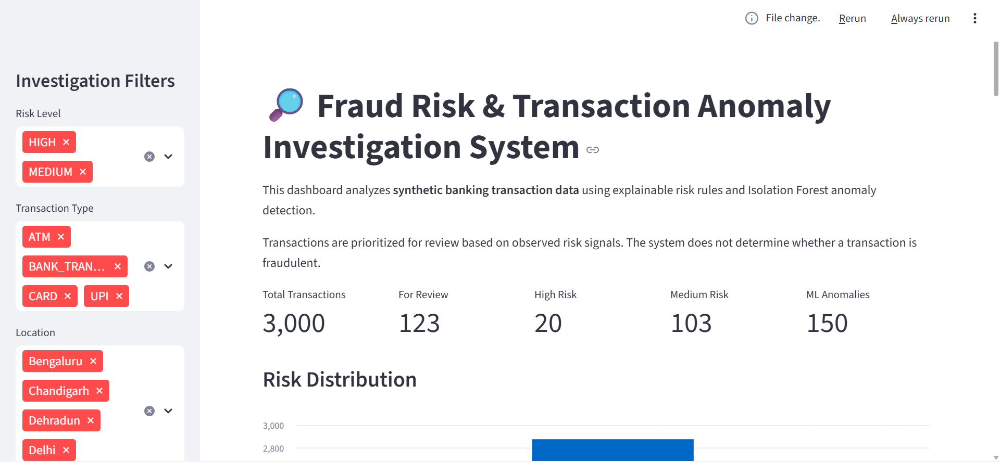
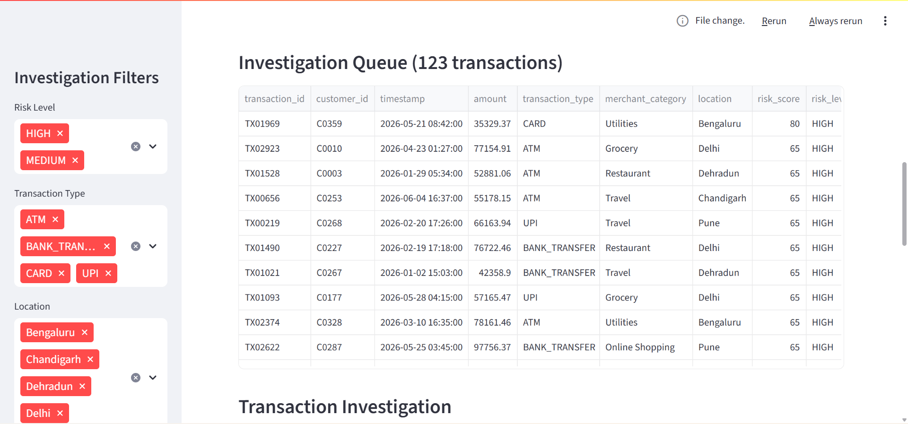
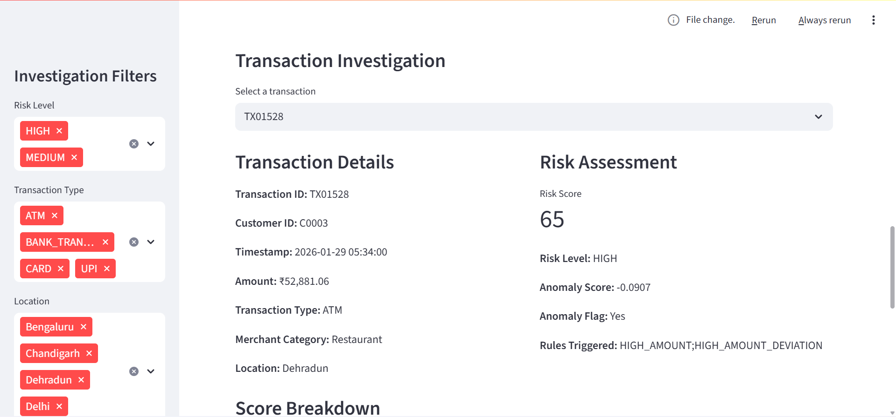
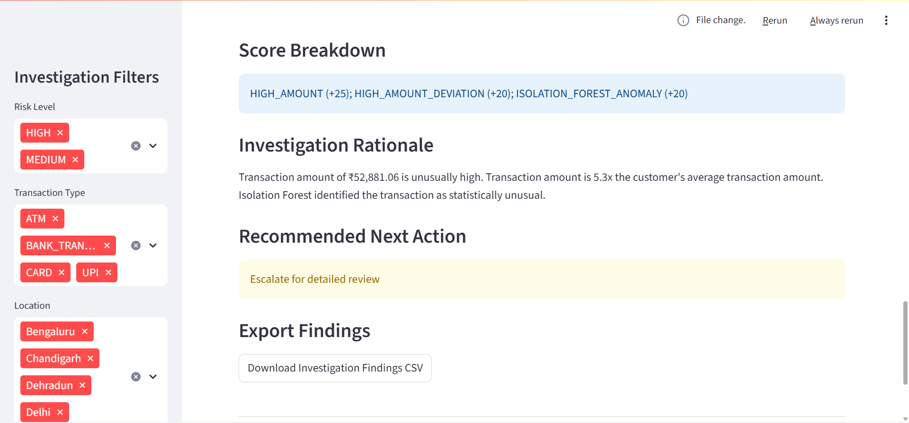

# Fraud Risk & Transaction Anomaly Investigation System

A Python-based transaction risk screening project that analyzes synthetic banking transactions, identifies unusual patterns, and prioritizes transactions for review.

The system combines data validation, transaction behaviour analysis, rule-based risk detection, Isolation Forest anomaly detection, explainable risk scoring, and an investigation workflow with a Streamlit dashboard.

> **Note:** This project uses synthetic transaction data and is intended as a risk-screening prototype. It does not represent a production fraud detection or compliance system.

## Key Features

* Synthetic banking transaction data generation
* Data quality and validation checks
* Transaction behaviour feature engineering
* Rule-based risk detection
* Isolation Forest anomaly detection
* Explainable risk scoring
* Investigation queue for medium and high-risk transactions
* Investigation rationale and recommended review actions
* Streamlit dashboard for transaction review
* Automated testing with pytest

## How It Works

The project processes transactions through the following pipeline:

**Transaction Data → Validation → Feature Engineering → Risk Rules → Isolation Forest → Risk Score → Investigation Queue**

### 1. Data Validation

The generated transaction data is checked for:

* Missing values
* Duplicate transaction IDs
* Invalid transaction amounts
* Invalid timestamps
* Invalid transaction types
* Invalid merchant categories
* Invalid locations

### 2. Feature Engineering

The system creates transaction behaviour features including:

* Customer average transaction amount
* Amount deviation from customer average
* Time since previous transaction
* Transactions within the last 10 minutes
* Transactions within the last hour
* Transaction velocity
* Location changes
* Customer transaction count

### 3. Risk Detection

The system combines rule-based checks with machine-learning anomaly detection to identify unusual transactions.

### 4. Risk Scoring

Detected signals are combined into an explainable risk score.

### 5. Investigation Queue

Medium and high-risk transactions are added to an investigation queue with the signals that triggered the risk score, a human-readable rationale, and a suggested review action.

---

## Risk Detection

### Rule-Based Checks

The following transaction patterns are used as risk signals:

| Risk Signal           | Condition                          | Points |
| --------------------- | ---------------------------------- | -----: |
| High Amount           | Transaction amount ≥ ₹30,000       |    +25 |
| High Amount Deviation | Amount ≥ 5× customer average       |    +20 |
| High Velocity         | 3+ transactions within 10 minutes  |    +20 |
| Rapid Location Change | Location changes within 60 minutes |    +15 |
| ML Anomaly            | Isolation Forest anomaly           |    +20 |

These thresholds and weights are project-defined assumptions for demonstrating transaction risk screening.

### Anomaly Detection

Isolation Forest is used to identify transactions that appear unusual based on transaction behaviour.

The model considers features such as:

* Transaction amount
* Amount deviation
* Transaction frequency
* Time between transactions
* Account age
* Recent transaction activity

The Isolation Forest result is treated as an additional risk signal rather than proof that a transaction is fraudulent.

### Risk Levels

| Risk Level |  Score |
| ---------- | -----: |
| LOW        |   0–29 |
| MEDIUM     |  30–59 |
| HIGH       | 60–100 |

The score is a project-defined prioritization mechanism and should not be interpreted as a probability of fraud.

---

## Investigation Workflow

Transactions classified as MEDIUM or HIGH risk are added to the investigation queue.

For each transaction, the system records:

* Transaction ID
* Customer ID
* Timestamp
* Transaction amount
* Transaction type
* Merchant category
* Location
* Previous location
* Customer average amount
* Amount deviation
* Recent transaction activity
* Risk signals
* Isolation Forest anomaly score
* Final risk score
* Risk level
* Score breakdown
* Investigation rationale
* Recommended action

Example review actions include:

* **HIGH:** Escalate for detailed review
* **MEDIUM:** Request additional verification
* **LOW:** Close / no further action

These are prototype recommendations and are not compliance decisions.

---

## Results

The current implementation processes:

* **3,000** synthetic transactions
* **500** synthetic customers
* **150** Isolation Forest anomalies
* **123** transactions requiring review
* **103** MEDIUM-risk transactions
* **20** HIGH-risk transactions
* **14/14** automated tests passing

The investigation findings are saved to:

```text
reports/investigation_findings.csv
```

---

## Testing

The project includes automated tests using **pytest**.

The tests cover:

* Dataset size and integrity
* Missing values
* Data validation
* Invalid transaction values
* Risk detection rules
* High-velocity detection
* Rapid location change detection
* Risk scoring
* Multiple risk signals
* Machine-learning anomaly contribution
* Normal transactions

Current test result:

```text
14 passed
0 failed
```

Run the tests with:

```bash
python -m pytest -v
```

---

## Dashboard

The project includes a Streamlit dashboard for reviewing transaction screening results.

### Main Dashboard



### Investigation Queue



### Transaction Details



### Risk Breakdown



---

## Project Structure

```text
fraud-risk-transaction-investigation/
│
├── .gitignore
├── app.py
├── README.md
├── requirements.txt
│
├── data/
│   └── raw/
│       └── transactions.csv
│
├── reports/
│   └── investigation_findings.csv
│
├── screenshots/
│   ├── dashboard.png
│   ├── investigation_queue.png
│   ├── transaction_details.png
│   └── risk_breakdown.png
│
├── src/
│   ├── anomaly_detection.py
│   ├── feature_engineering.py
│   ├── generate_data.py
│   ├── investigation.py
│   ├── risk_scoring.py
│   ├── rules.py
│   └── validation.py
│
└── tests/
    ├── test_data_quality.py
    ├── test_risk_scoring.py
    ├── test_rules.py
    └── test_validation.py
```

---

## Technologies Used

* **Python**
* **Pandas**
* **NumPy**
* **Scikit-learn**
* **Isolation Forest**
* **Streamlit**
* **Pytest**

---

## How to Run

### 1. Clone the repository

```bash
git clone https://github.com/anujpratap12/fraud-risk-transaction-investigation.git
cd fraud-risk-transaction-investigation
```

### 2. Install dependencies

```bash
pip install -r requirements.txt
```

### 3. Generate transaction data

```bash
python src/generate_data.py
```

### 4. Run the investigation workflow

```bash
python src/investigation.py
```

This generates:

```text
reports/investigation_findings.csv
```

### 5. Start the dashboard

```bash
streamlit run app.py
```

The terminal will provide the local Streamlit URL.

### 6. Run tests

```bash
python -m pytest -v
```

---

## Limitations

* The project uses synthetically generated transaction data.
* Risk thresholds and scoring weights were defined for this project.
* Isolation Forest identifies unusual transactions but does not determine whether a transaction is fraudulent.
* The system is a risk-screening prototype, not a production fraud detection or compliance system.
* The model has not been evaluated against a labelled real-world fraud dataset.
* Customer transaction baselines could be improved using historical rolling features.

---

## Future Improvements

* Use historical transaction data for stronger customer-level baselines
* Add additional behavioural and temporal features
* Evaluate the model using labelled transaction data
* Add model performance metrics such as precision, recall, and F1-score
* Store investigation cases in a database
* Add authentication and role-based access
* Add case management and investigation status tracking
* Generate detailed investigation reports
* Add model monitoring and drift detection

---

## Author

**Anuj Pratap Singh**

B.Tech Computer Science & Engineering — Artificial Intelligence & Machine Learning
UPES Dehradun

GitHub: [@anujpratap12](https://github.com/anujpratap12)
